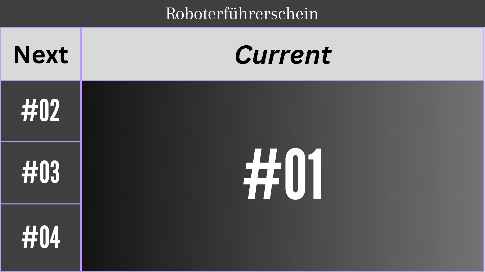
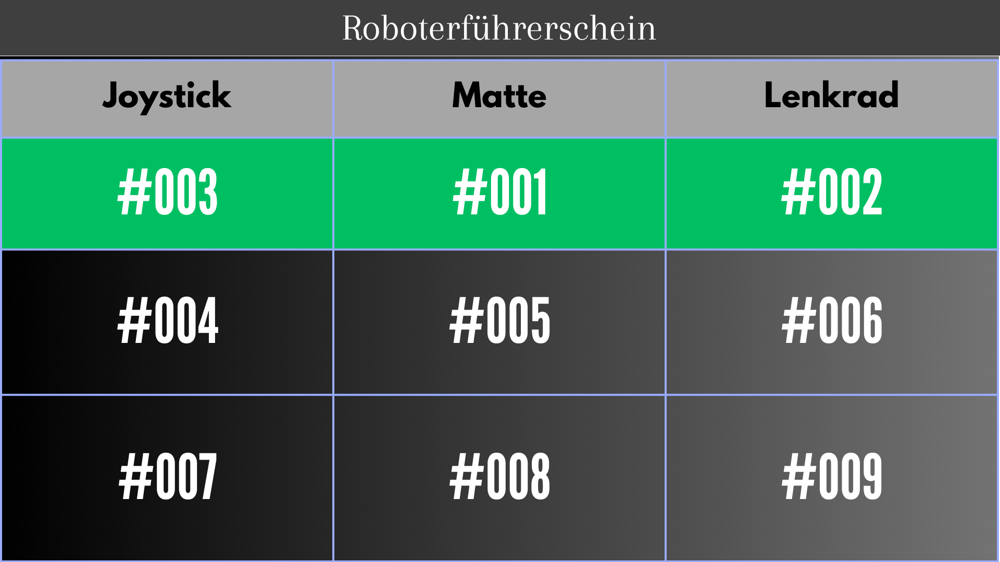
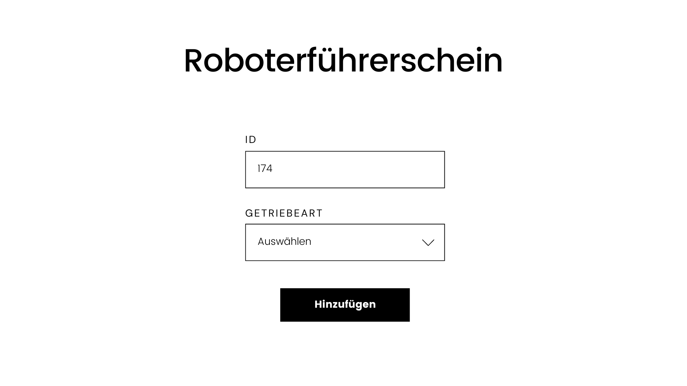

= Pflichtenheft Terminverwaltung
:toc: left
:sectnums:
:toclevels: 1
:table-caption:

Version: 1.0

Version Date: 24-04-2024

Authors:

* f.stroschneider@students.htl-leonding.ac.at
* a.ignac@students.htl-leonding.ac.at

== Beschreibung der Ausgangslage

Am Tag der offenen Türe gibt es die Möglichkeiten bei verschiedenen Stationen eine Aktivität auszuprobieren.

== Ist-Zustand

Derzeit ist eine lange Wartezeit beim Absolvieren der verschiedenen Aktivitäten.

== Problemstellung

Die Besucher kommen derzeit in Gruppen zu der Stadtion dadurch ist die Station häufig ausgelastet, jedoch gibt es auch
das Gegenteil im welchen fall sich niemand anstellt.

== Aufgabenstellung

=== Funktionale Anforderungen

Es soll möglich sein mithilfe einer QR-Scanner-App einen QR-Code einer Stadtion zu scannen und sich somit in die Queue
einzureihen.

Der Besucher kann sich in mehrere Queues einreihen und bekommt eine Benachrichtigung, wenn er an der Reihe ist.

=== Nicht-funktionale Anforderungen

* Sicherheitsanforderung
** Die Daten sollen vor Dritten geschützt werden.

* Zuverlässigkeit
** Das System soll, in einer vorhersehbaren und zuverlässigen Weise zu funktionieren.

* Benutzbarkeit
** Das System soll, so gestaltet werden, dass es einfach und intuitiv von Benutzern verwendet werden kann.

* Effizienz
** Das System soll die Ressourcen effizient nutzen.

* Übertragbarkeit
** Das System soll, auf andere Systeme oder Umgebungen übertragen werden können.

* Wartbarkeit
** Das System soll, Wartung- und Reparaturarbeiten in einfacher und schneller Weise durchführen können.

=== MockUp

.Display Ansicht
[%collapsible]
====

Diese Ansicht wird auf den Bildschirm angezeigt, wenn nur ein Roboter fährt.

Auf der linken Seite werden die Nummern angezeigt, die als Nächstes dran sind.
====

.Display Ansicht mehrere Roboter
[%collapsible]
====

Diese Ansicht wird auf den Bildschirm angezeigt, wenn mehrere Roboter fahren.

Die Grün markierten Nummern sind die Nummern, die gerade dran sind, die darunter sind die Nummern, die als Nächstes dran sind.
====

.Hinzufügen einer neuen Nummer
[%collapsible]
====

In dem ID-Feld wird die Nummer von dem Zettel eingegeben.

Bei dem Getriebeartfeld wird die Getriebeart ausgewählt, die derzeit zur Verfügung sind z.B. Matte oder Joystick und worauf gefahren werden soll.

Beim Betätigen der "Hinzufügen-"Taste wird die Nummer in die Warteschlange hinzugefügt.

Es wird auch eine Bestätigung angezeigt, dass die Nummer hinzugefügt wurde, andererseits wird eine Fehlermeldung angezeigt, in welcher Aufgefordert wird zu der Stadtion zu gehen und sich zu melden.
====

== Diagramme

.Use-case Diagramm
[%collapsible]
====
[plantuml, Usecasediagramm, png]
----
include::plantuml/Usecasediagramm.puml[]
----
====

.Klassen Diagramm
[%collapsible]
====
[plantuml, Klassendiagramm, png]
----
include::plantuml/Klassendiagramm.puml[]
----
====

== Zielsetzung

Die Wartezeit für die Besucher sollen minimiert werden und für eine bessere Besucherauslastung der Station sorgen.

== Rahmenbedingungen

Programmiersprache: Typescript
Datenbank: Sqlite
Keycloack

== Administratives

----
Team: Stroschneider Fabian & Ignac Antonio
----